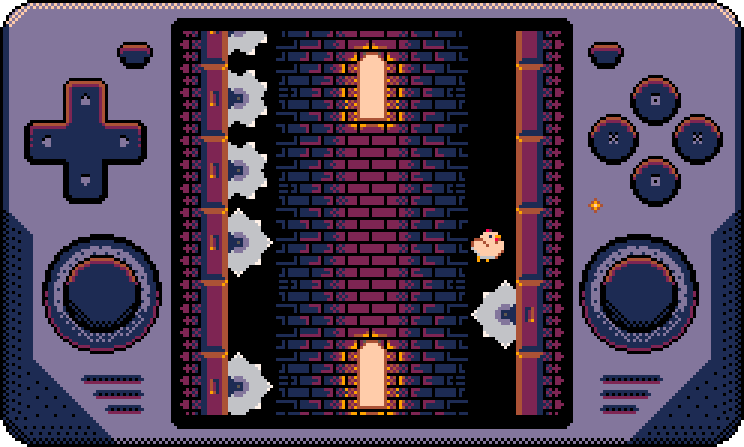
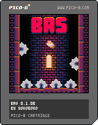

# Birds and Saws PICO-8 Demake



I hope you will enjoy this PICO-8 retro game demake! Feel free to contribute, share your thoughts, and embrace the spirit of creativity that PICO-8 embodies.

## Cartridge



## Play Online

Experience the game directly on the Pico-8 BBS forum. Dive into the action and play it now: [Pico-8 BBS Forum](https://www.lexaloffle.com/bbs/?tid=54986)

Featured on Pico-8 website:

[](https://www.lexaloffle.com/bbs/?tid=54986)

## Getting Started

To run this game, you'll need to download the [cartridge](bin/bas.p8.png) and have PICO-8 installed on your system. You can [download PICO-8 from the official website](https://www.lexaloffle.com/pico-8.php).

Once you have PICO-8 installed, load the game by executing the following command in your PICO-8 command prompt:

```shell
load bas.p8.png
```

## About PICO-8

PICO-8 is a fantasy console that encapsulates the essence of the golden age of gaming.

- **Fantasy Console**: PICO-8 is designed as a retro-futuristic fantasy console. It simulates the constraints of hardware from the past, providing a unique creative challenge.

- **Lua Programming**: PICO-8 uses the Lua programming language, making it accessible to both experienced developers and newcomers.

- **Pixel Art**: Embrace the pixel art style with PICO-8's 8x8 pixel sprites. Create charming, nostalgic visuals that hark back to the classic games of the '80s and '90s.

- **Sound and Music**: PICO-8 supports chiptune-style music and sound effects, allowing you to compose catchy retro tunes for your game.

- **Limited Resources**: You have a limited number of tokens (code space), memory, and other resources to work with, just like classic game developers. These constraints spark creativity and problem-solving.